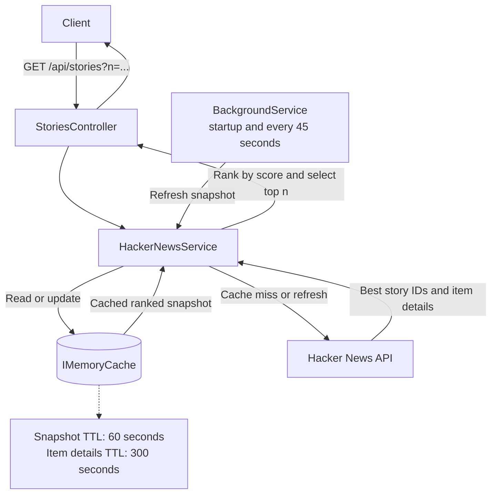

# Hacker News Best Stories API

An ASP.NET Core REST API that returns the highest-scoring stories from Hacker News' `beststories` feed.

## Requirements

- .NET 10 SDK
- Network access to `hacker-news.firebaseio.com`

## Run

From the repository root:

```sh
dotnet restore HackerNews.sln
dotnet run --project src/HackerNews.Api/HackerNews.Api.csproj --launch-profile http
```

The API listens at `http://localhost:5292` with the included launch profile.

Run the unit tests with:

```sh
dotnet test HackerNews.sln
```

## Endpoint

```http
GET /api/stories?n={count}
```

For example, `GET http://localhost:5292/api/stories?n=10` returns up to 10 stories, ordered by descending score:

```json
[
	{
		"title": "Example story",
		"uri": "https://example.com/story",
		"postedBy": "user",
		"time": "2026-10-05T12:00:00+00:00",
		"score": 123,
		"commentCount": 45
	}
]
```

`n` is required and must be between 1 and 500. The response may contain fewer than `n` stories if Hacker News returns fewer valid story records.

## Implementation and assumptions

- Story IDs come from Hacker News' `beststories.json`; item details are fetched from `item/{id}.json`.
- The API loads up to 500 entries, sorts the valid story details by score descending, and uses posting time as a deterministic tie-breaker.
- A process-wide in-memory cache keeps the ranked snapshot for 60 seconds and individual story details for 300 seconds. A hosted background service warms the snapshot at startup and refreshes it every 45 seconds, reusing still-cached item details. The cache starts cold after a restart; refresh failures are logged and retried on the next interval.
- A singleton refresh lock prevents concurrent requests from rebuilding the same expired snapshot. At most 8 item requests are sent upstream concurrently.
- Deleted or incomplete items are omitted. Missing URL values are returned as `null`; absent score and comment counts default to zero.
- Upstream connection failures, timeouts, HTTP errors, and invalid JSON return `503 Service Unavailable` with Problem Details. Client-request cancellation is allowed to propagate.
- Cache durations, the background refresh interval, upstream base URL, concurrency limit, and story limit are configurable in `appsettings.json`.

## Request and cache flow



## Possible enhancements

- Use a distributed cache for multi-instance deployments and coordinate snapshot refreshes across instances.
- Add explicit upstream retry/backoff, circuit breaking, and a client-facing rate limit.
- Add integration tests with a mocked Hacker News API, plus metrics and health checks for upstream availability.
